<!-- Generated by scripts/build_team_page.py. Edit content/team/. -->
::: {.team-page}
::: {.hero .team-hero style="--hero-image: url('content/images/team-hero.png');"}
::: {.hero-copy}

Team

<h1>Different backgrounds, shared questions.</h1>

Our laboratory is based in Trieste. Some members work across partner institutes and are co-supervised with collaborating principal investigators.

:::
:::

<section class="team-section">

Leadership
<h2>Principal investigator</h2>

<article class="team-card team-card-pi" data-profile="giulio-caravagna.md">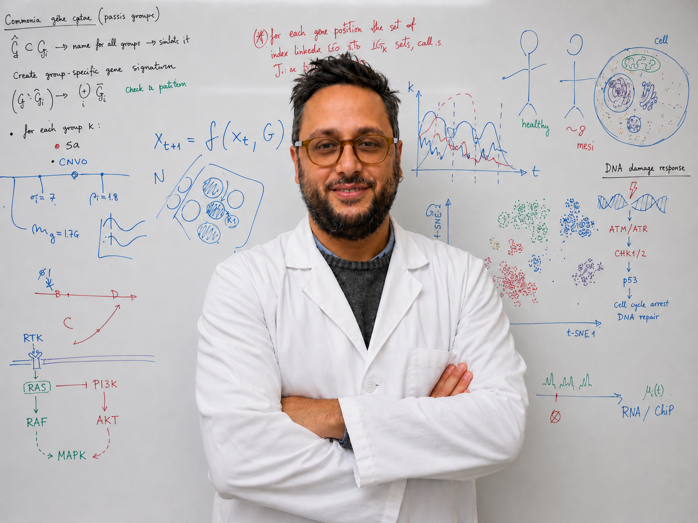
Principal investigator<h3>Giulio Caravagna, PhD</h3>
<a href="mailto:gcaravagna@units.it"><i class="bi bi-envelope"></i> Email</a><a href="https://app.reclaim.ai/m/giulio-caravagna" target="_blank" rel="noopener"><i class="bi bi-calendar3"></i> Meet Giulio</a>

Research interests

<ul><li>Cancer evolution and tumour phylogenetics</li><li>Machine learning for cancer genomics</li><li>Bayesian inference and computational oncology</li><li>Treatment resistance and disease forecasting</li></ul>

Positions

<ul><li>Associate Professor, Department of Mathematics and Geosciences, University of Trieste</li><li>Core Faculty, PhD programme in Applied Data Science &amp; Artificial Intelligence, University of Trieste</li><li>Adjunct Faculty, PhD programme in Theoretical and Scientific Data Science, SISSA</li><li>Honorary Fellow, The Institute of Cancer Research, UK</li></ul>

Training

<ul><li>2017–20, The Institute of Cancer Research, UK, with Andrea Sottoriva</li><li>2015–17, University of Edinburgh, UK, with Guido Sanguinetti</li><li>2011–15, University of Milan-Bicocca, Italy, with Giancarlo Mauri and Marco Antoniotti</li><li>2011, PhD in Computer Science, University of Pisa</li><li>BSc and MSc in Computer Science, University of Pisa</li></ul>

</article>
</section>

<section class="team-section team-section-tinted">

Scientists
<h2>Postdoctoral researchers</h2>

<article class="team-card" data-profile="nicola-calonaci.md">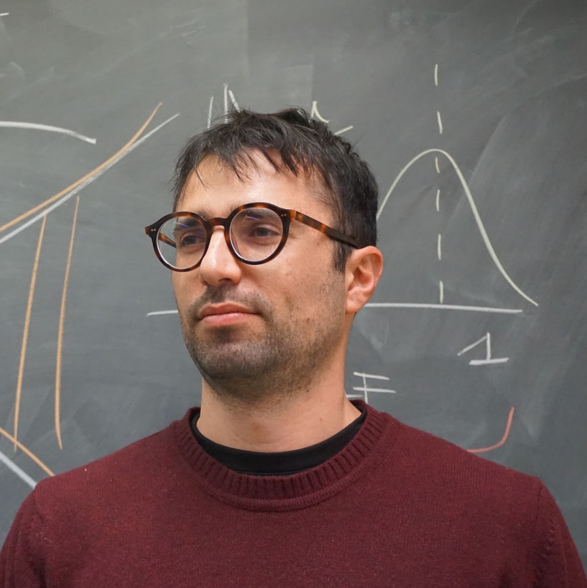
<h3>Nicola Calonaci</h3>
<a href="mailto:nicola.calonaci@units.it"><i class="bi bi-envelope"></i> Email</a>

Research interests

<ul><li>Statistical physics of biological systems</li><li>Computational oncology</li><li>Probabilistic modelling of tumour evolution</li></ul>

Background

<ul><li>2021, PhD in Physics and Chemistry of Biological Systems, SISSA.</li><li>MSc in Physics, University of Pisa.</li><li>BSc in Physics, University of Pisa.</li></ul>

</article>
<article class="team-card" data-profile="alice-antonello.md">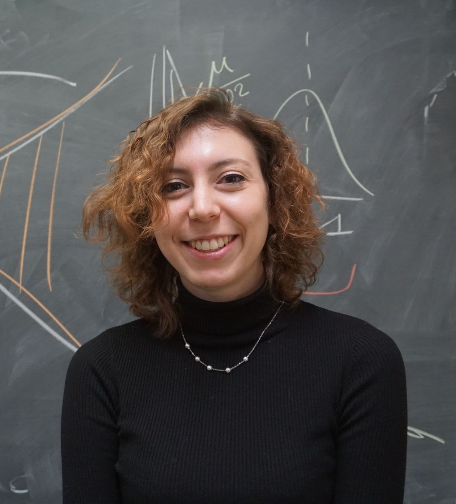
<h3>Alice Antonello</h3>
<a href="mailto:alice.antonello@phd.units.it"><i class="bi bi-envelope"></i> Email</a><a class="team-thesis" href="https://tesidottorato.depositolegale.it/handle/20.500.14242/189363" target="_blank" rel="noopener" title="Timing the onset of therapy resistance after Allo-HSCT in AML using Bayesian inference" aria-label="PhD thesis: Timing the onset of therapy resistance after Allo-HSCT in AML using Bayesian inference"><i class="bi bi-mortarboard"></i> PhD thesis</a>

Research interests

<ul><li>Therapy resistance in acute myeloid leukaemia</li><li>Bayesian inference</li><li>Longitudinal cancer genomics</li><li>Quantitative and computational biology</li></ul>

Background

AIRC Postdoctoral Fellow (independent fellowship).
<ul><li>2025, PhD in Applied Data Science &amp; Artificial Intelligence, University of Trieste.</li><li>MSc in Quantitative and Computational Biology, University of Trento.</li><li>BSc in Biotechnology, University of Turin.</li></ul>

</article>
<article class="team-card" data-profile="elena-buscaroli.md">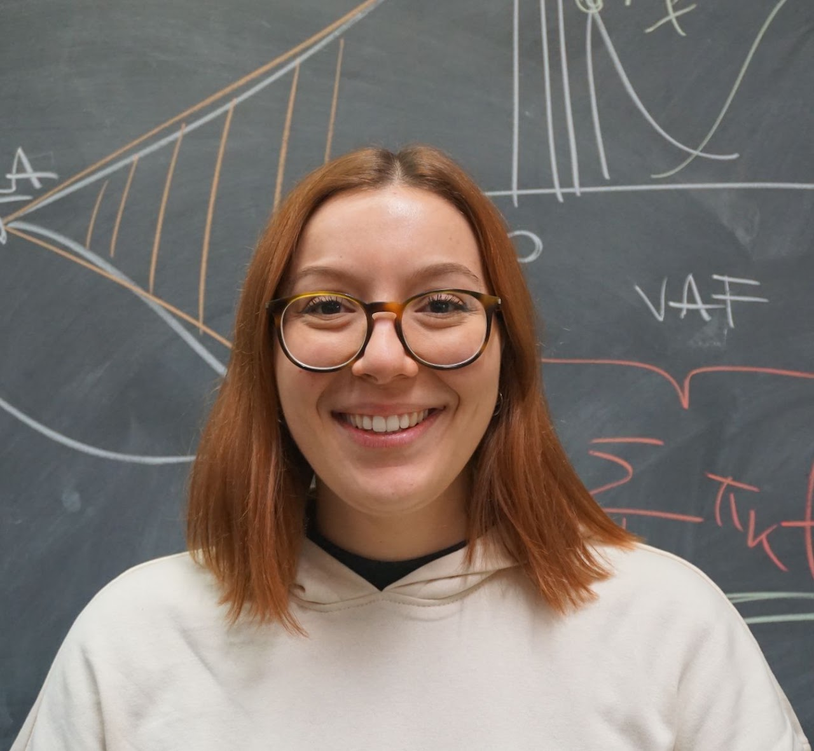
<h3>Elena Buscaroli</h3>
<a href="mailto:elena.buscaroli@units.it"><i class="bi bi-envelope"></i> Email</a><a class="team-thesis" href="https://tesidottorato.depositolegale.it/handle/20.500.14242/357311" target="_blank" rel="noopener" title="Bayesian inference of lineage evolution and molecular profiling in cancer and gene therapy" aria-label="PhD thesis: Bayesian inference of lineage evolution and molecular profiling in cancer and gene therapy"><i class="bi bi-mortarboard"></i> PhD thesis</a>

Research interests

<ul><li>Bayesian inference of lineage evolution</li><li>Cancer molecular profiling</li><li>Gene therapy</li><li>Single-cell and high-throughput sequencing</li></ul>

Background

<ul><li>MSc in Data Science and Scientific Computing, University of Trieste.</li><li>BSc in Genetics, University of Bologna.</li></ul>

</article>
<article class="team-card" data-profile="lucrezia-valeriani.md">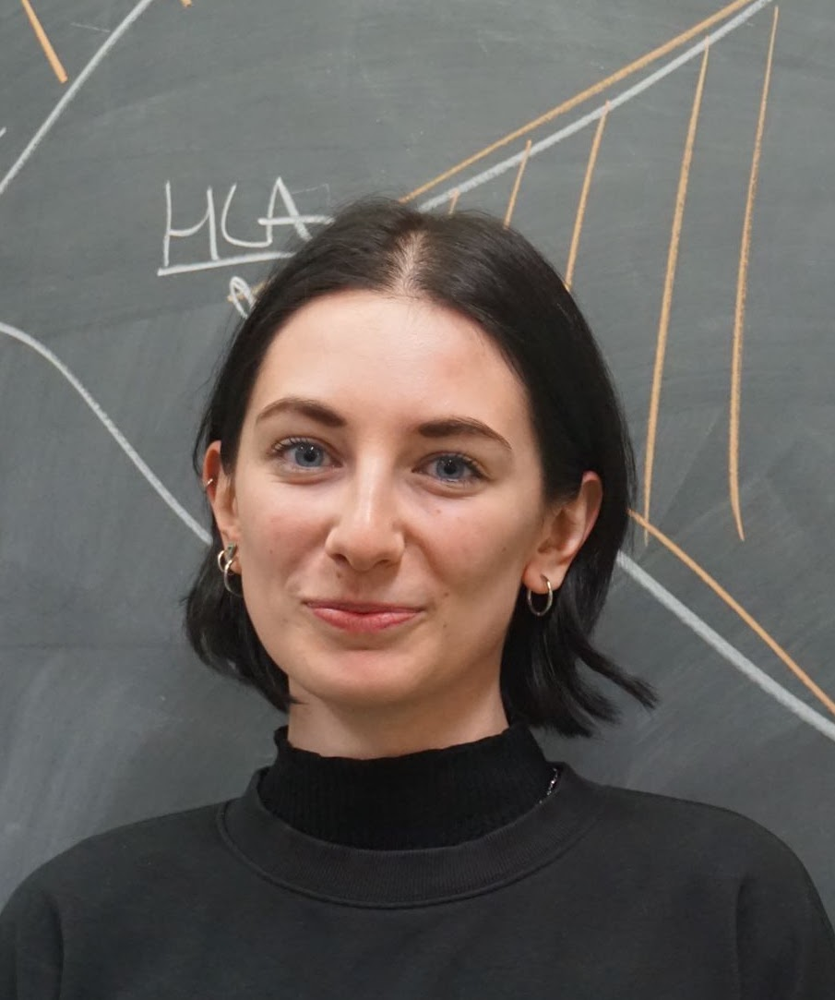
<h3>Lucrezia Valeriani</h3>
<a href="mailto:lucrezia.valeriani@units.it"><i class="bi bi-envelope"></i> Email</a><a class="team-thesis" href="https://tesidottorato.depositolegale.it/handle/20.500.14242/357309" target="_blank" rel="noopener" title="Computational modelling of the interplay between genetic and epigenetic in tumour evolution" aria-label="PhD thesis: Computational modelling of the interplay between genetic and epigenetic in tumour evolution"><i class="bi bi-mortarboard"></i> PhD thesis</a>

Research interests

<ul><li>Genetic and epigenetic tumour evolution</li><li>Computational cancer genomics</li><li>Machine learning for molecular data</li></ul>

Background

<ul><li>MSc in Data Science and Scientific Computing, University of Trieste.</li><li>BSc in Genetics, University of Bologna.</li></ul>

</article>
</section>

<section class="team-section">

Researchers in training
<h2>PhD researchers</h2>

<article class="team-card" data-profile="davide-testa.md">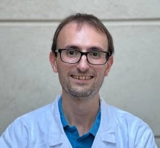
ADSAI · 2025–28<h3>Davide Testa</h3>
<a href="mailto:davide.testa@phd.units.it"><i class="bi bi-envelope"></i> Email</a>

Research interests

<ul><li>Computational immunology</li><li>Allogeneic transplantation</li><li>Cancer evolution and treatment response</li></ul>

Background

Co-supervised with Luca Vago at IRCCS San Raffaele.
<ul><li>Medicine, University of Pisa.</li><li>Specialty in Immunology, University of Pisa.</li></ul>

</article>
<article class="team-card" data-profile="giorgia-gandolfi.md">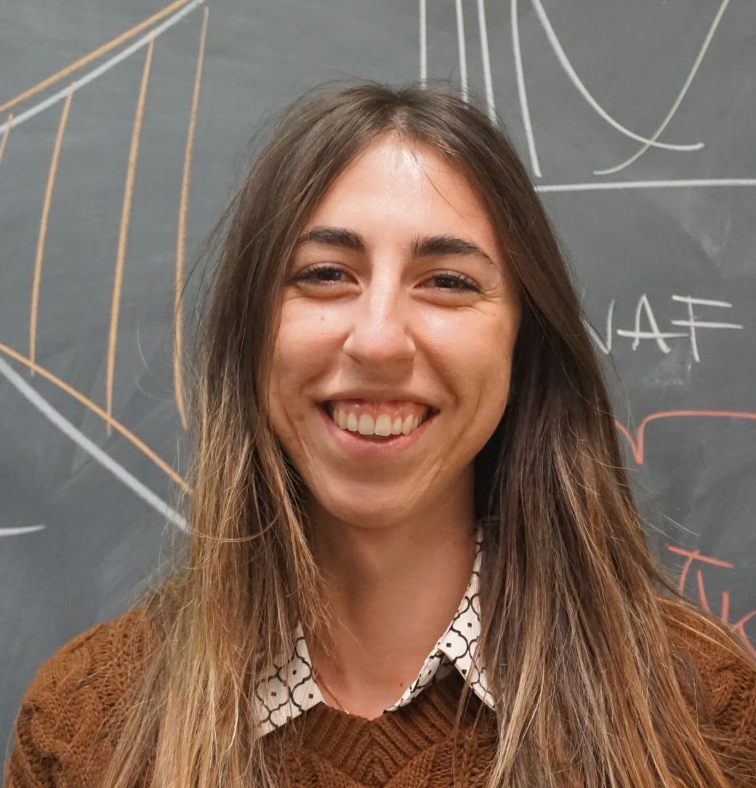
ADSAI · 2024–27<h3>Giorgia Gandolfi</h3>
<a href="mailto:giorgia.gandolfi@phd.units.it"><i class="bi bi-envelope"></i> Email</a>

Research interests

<ul><li>Cancer bioinformatics</li><li>Machine learning for tumour profiling</li><li>High-throughput sequencing</li></ul>

Background

Sponsored by IRCCS San Raffaele and co-supervised with Giovanni Tonon.
<ul><li>MSc in Bioinformatics, University of Bologna.</li><li>BSc in Biology, University of Parma.</li></ul>

</article>
<article class="team-card" data-profile="virginia-gazziero.md">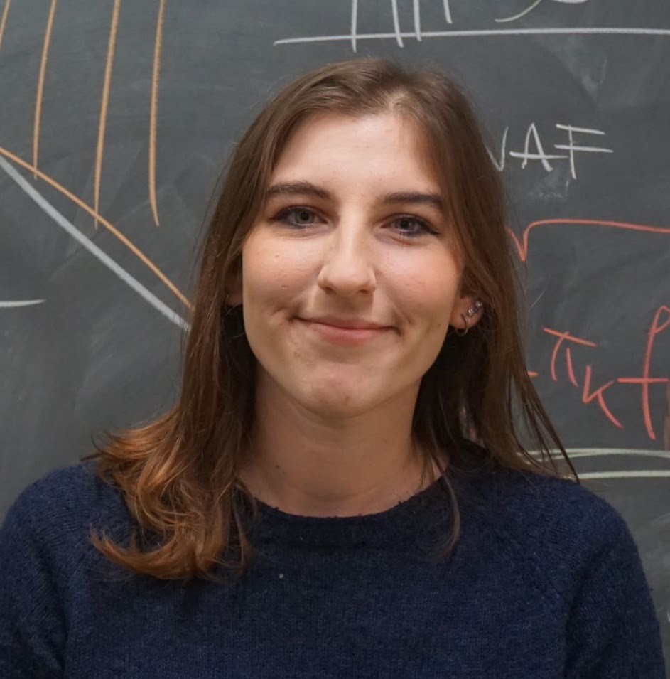
ADSAI · 2024–27<h3>Virginia Gazziero</h3>
<a href="mailto:virginia.gazziero@phd.units.it"><i class="bi bi-envelope"></i> Email</a>

Research interests

<ul><li>Functional genomics</li><li>Cancer immunology</li><li>Machine learning for molecular data</li></ul>

Background

Sponsored by Toscana Life Sciences and co-supervised with Anna Kabanova.
<ul><li>MSc in Functional Genomics, University of Trieste.</li><li>BSc in Biotechnology, University of Insubria.</li></ul>

</article>
<article class="team-card" data-profile="eriseld-krasniqi.md">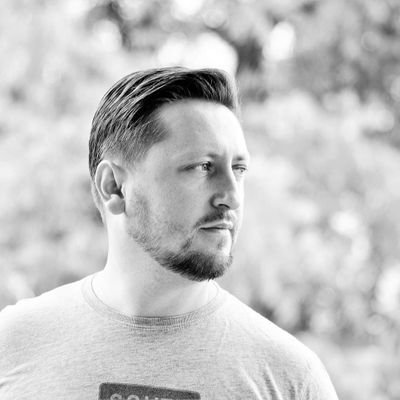
ADSAI · 2024–27<h3>Eriseld Krasniqi</h3>
<a href="mailto:eriseld.krasniqi@phd.units.it"><i class="bi bi-envelope"></i> Email</a>

Research interests

<ul><li>Clinical oncology</li><li>Precision medicine</li><li>Machine learning for clinical and genomic cancer data</li></ul>

Background

Sponsored by the IRCCS Regina Elena National Cancer Institute.
<ul><li>Degree in Medicine and Surgery, University of Rome Tor Vergata.</li><li>Specialty in Medical Oncology, University of Rome Tor Vergata.</li></ul>

</article>
<article class="team-card" data-profile="azad-sadr.md">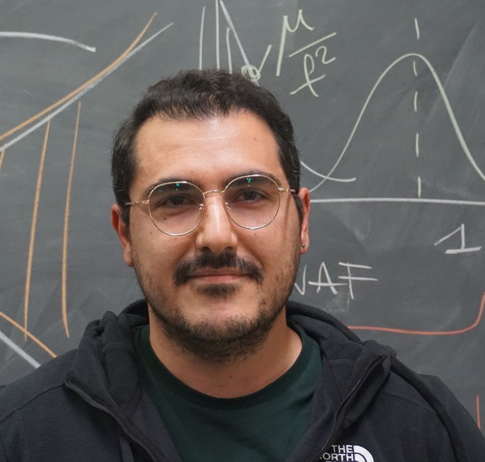
ADSAI · 2024–27<h3>Azad Sadr</h3>
<a href="mailto:azad.sadr@phd.units.it"><i class="bi bi-envelope"></i> Email</a>

Research interests

<ul><li>Machine learning</li><li>Computational modelling</li><li>Optimisation and data-driven methods in cancer research</li></ul>

Background

<ul><li>MSc in Industrial Engineering, Wayne State University, USA.</li><li>BSc in Industrial Engineering, Kar Higher Education Institute, Iran.</li></ul>

</article>
<article class="team-card" data-profile="sara-cocomello.md">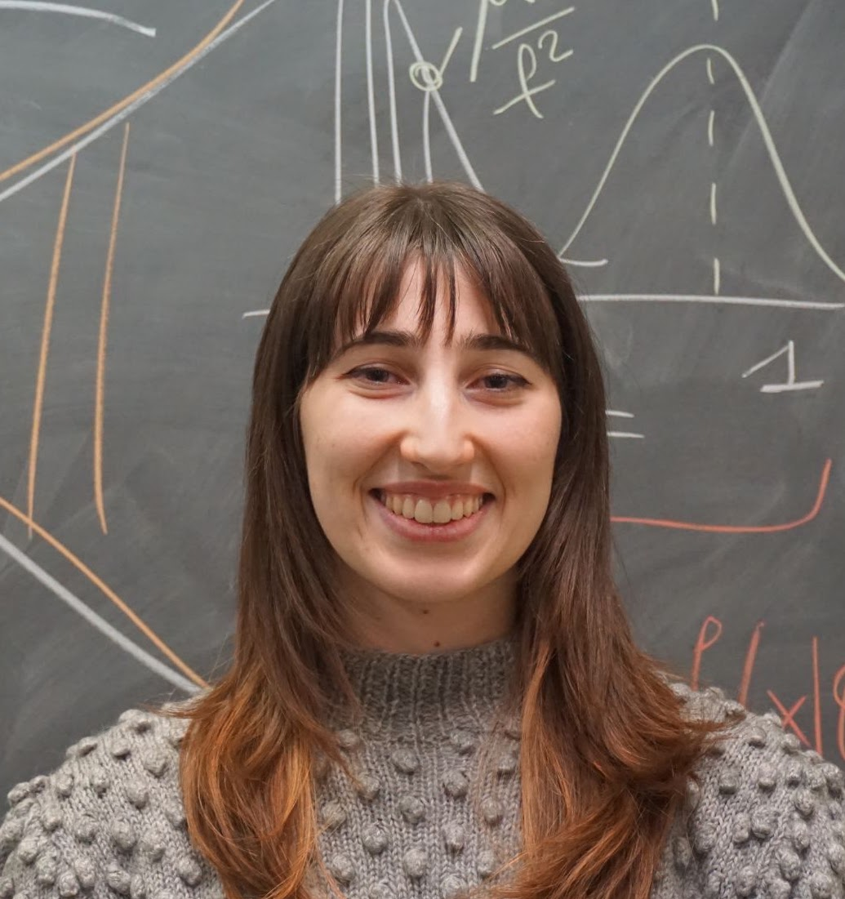
ADSAI · 2024–27<h3>Sara Cocomello</h3>
<a href="mailto:sara.cocomello@phd.units.it"><i class="bi bi-envelope"></i> Email</a>

Research interests

<ul><li>Statistical learning</li><li>Cancer data science</li><li>Computational modelling</li></ul>

Background

<ul><li>MSc in Data Science and Scientific Computing, University of Trieste.</li><li>BSc in Economics.</li></ul>

</article>
<article class="team-card" data-profile="elena-rivaroli.md">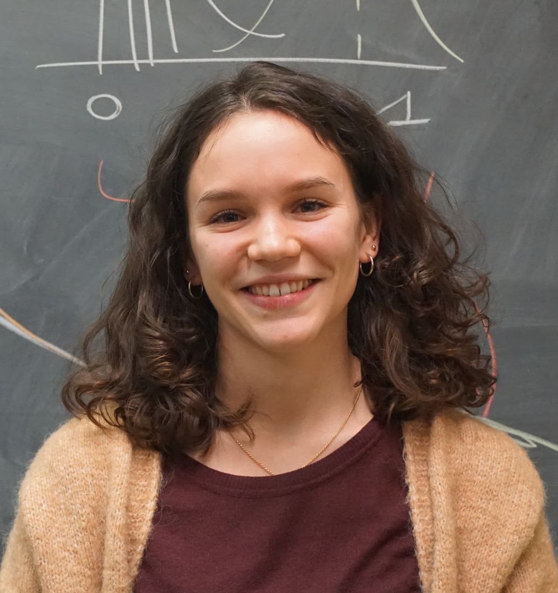
ADSAI · 2024–27<h3>Elena Rivaroli</h3>
<a href="mailto:elena.rivaroli@phd.units.it"><i class="bi bi-envelope"></i> Email</a>

Research interests

<ul><li>Machine learning</li><li>Cancer genomics</li><li>Scientific computing</li></ul>

Background

<ul><li>MSc in Data Science and Scientific Computing, University of Trieste.</li><li>BSc in Computer Engineering.</li></ul>

</article>
<article class="team-card team-card-text" data-profile="edoardo-insaghi.md">
EI

ADSAI · 2025–28<h3>Edoardo Insaghi</h3>
<a href="mailto:edoardo.insaghi@phd.units.it"><i class="bi bi-envelope"></i> Email</a>

Research interests

<ul><li>Statistical learning</li><li>Bayesian modelling</li><li>Applied data science</li></ul>

Background

Co-supervised with Leonardo Egidi.

</article>
</section>

<section class="team-section team-section-tinted">

Students
<h2>MSc and BSc researchers</h2>

<article class="team-card" data-profile="eleonora-tiozzo.md">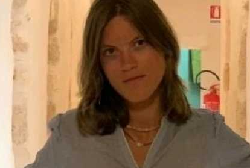
MSc · 2026<h3>Eleonora Tiozzo</h3>

Research interests

<ul><li>Data science</li><li>Scientific computing</li><li>Computational oncology</li></ul>

Background

MSc programme in Data Science and Scientific Computing. Co-supervised with Nicola Calonaci.

</article>
<article class="team-card" data-profile="fabio-zinzone.md">
AIRC4Youth · MSc · 2025<h3>Fabio Zinzone</h3>

Research interests

<ul><li>Physics</li><li>Cancer data science</li><li>Computational oncology</li></ul>

Background

MSc programme in Physics. Co-supervised with Giorgia Gandolfi.

</article>
<article class="team-card team-card-text" data-profile="lorenzo-bottelli.md">
LB

AIRC4Youth · UniUPO · 2026<h3>Lorenzo Bottelli</h3>

Research interests

<ul><li>To be updated.</li></ul>

Background

TBD

</article>
</section>

<section class="team-section">

Visitors
<h2>Visiting PhD researchers</h2>

<article class="team-card team-card-text" data-profile="daniel-colic.md">
DC

2024<h3>Daniel Colic</h3>
Frank Supek’s group · Institute for Research in Biomedicine, Barcelona.

</article>
<article class="team-card team-card-text" data-profile="carmen-oroperv.md">
CO

2024<h3>Carmen Oroperv</h3>
Søren Besenbacher’s group · Aarhus University.

</article>
<article class="team-card team-card-text" data-profile="nair-varela-ruoco.md">
NV

2023<h3>Nair Varela Ruoco</h3>
David Posada’s group · Biomedical Research Centre, University of Vigo.

</article>
</section>

<section class="team-section team-section-tinted">

Where they are now
<h2>Alumni</h2>

<article class="team-card team-card-text" data-profile="giovanni-santacatterina.md">
GS

PhD researcher<h3>Giovanni Santacatterina</h3>
Postdoc at St. Anna Children’s Cancer Research Institute, Vienna.

<a class="team-thesis" href="https://tesidottorato.depositolegale.it/handle/20.500.14242/357310" target="_blank" rel="noopener" title="Bayesian and computational modelling for evolutionary cancer dynamics: from coarse dynamics to single-cell resolution" aria-label="PhD thesis: Bayesian and computational modelling for evolutionary cancer dynamics: from coarse dynamics to single-cell resolution"><i class="bi bi-mortarboard"></i> PhD thesis</a>

</article>
<article class="team-card team-card-text" data-profile="katsiaryna-davydzenka.md">
KD

PhD researcher<h3>Katsiaryna Davydzenka</h3>
Current position to be confirmed.

</article>
<article class="team-card team-card-text" data-profile="alumnus-nicola-cortinovis.md">
NC

Student<h3>Nicola Cortinovis</h3>
Current position to be confirmed.

</article>
<article class="team-card team-card-text" data-profile="andrea-buscema.md">
AB

Student<h3>Andrea Buscema</h3>
Current position to be confirmed.

</article>
<article class="team-card team-card-text" data-profile="alumnus-riccardo-bergamin.md">
RB

Postdoctoral researcher<h3>Riccardo Bergamin</h3>
Current position to be confirmed.

</article>
<article class="team-card team-card-text" data-profile="alumnus-salvatore-milite.md">
SM

PhD researcher<h3>Salvatore Milite</h3>
AI Scientist at GSK, Zurich.

<a class="team-thesis" href="https://tesidottorato.depositolegale.it/handle/20.500.14242/353687" target="_blank" rel="noopener" title="Probabilistic and deep learning approaches to modeling biological systems" aria-label="PhD thesis: Probabilistic and deep learning approaches to modeling biological systems"><i class="bi bi-mortarboard"></i> PhD thesis</a>

</article>
<article class="team-card team-card-text" data-profile="brandon-hastings.md">
BH

Research associate<h3>Brandon Hastings</h3>
PhD researcher at the University of Nottingham.

</article>
<article class="team-card team-card-text" data-profile="emanuele-ruoppolo.md">
ER

Student<h3>Emanuele Ruoppolo</h3>
PhD researcher at Helmholtz Munich.

</article>
<article class="team-card team-card-text" data-profile="arianna-tasciotti.md">
AT

PhD researcher<h3>Arianna Tasciotti</h3>
AI Engineer at Leonardo S.p.A.

<a class="team-thesis" href="https://tesidottorato.depositolegale.it/handle/20.500.14242/195483" target="_blank" rel="noopener" title="Superspreading dynamics in epidemics: a deep learning and Bayesian inference framework for detection and characterization" aria-label="PhD thesis: Superspreading dynamics in epidemics: a deep learning and Bayesian inference framework for detection and characterization"><i class="bi bi-mortarboard"></i> PhD thesis</a>

</article>
<article class="team-card team-card-text" data-profile="lucrezia-patruno.md">
LP

PhD researcher<h3>Lucrezia Patruno</h3>
Postdoctoral researcher at University College London.

<a class="team-thesis" href="https://tesidottorato.depositolegale.it/handle/20.500.14242/74590" target="_blank" rel="noopener" title="Computational strategies for single-cell multi-omics data analysis and integration" aria-label="PhD thesis: Computational strategies for single-cell multi-omics data analysis and integration"><i class="bi bi-mortarboard"></i> PhD thesis</a>

</article>
<article class="team-card team-card-text" data-profile="lorenzo-taroni.md">
LT

Student<h3>Lorenzo Taroni</h3>
Software developer at Advancia Technology.

</article>
<article class="team-card team-card-text" data-profile="abdula-khalus.md">
AK

Student<h3>Abdula Khalus</h3>
Software developer at AI Factory.

</article>
<article class="team-card team-card-text" data-profile="clara-canavese.md">
CC

Student<h3>Clara Canavese</h3>
PhD researcher at SISSA and Human Technopole.

</article>
<article class="team-card team-card-text" data-profile="francesco-favagrossa.md">
FF

Student<h3>Francesco Favagrossa</h3>
Current position to be confirmed.

</article>
</section>

:::
