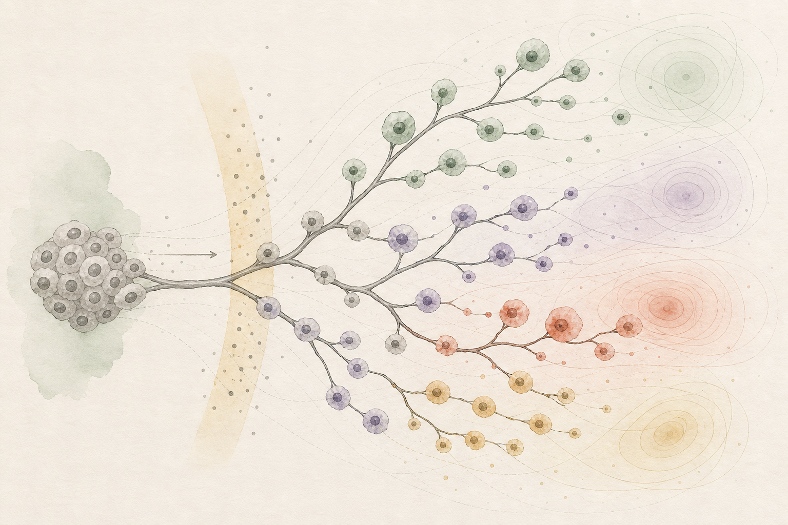
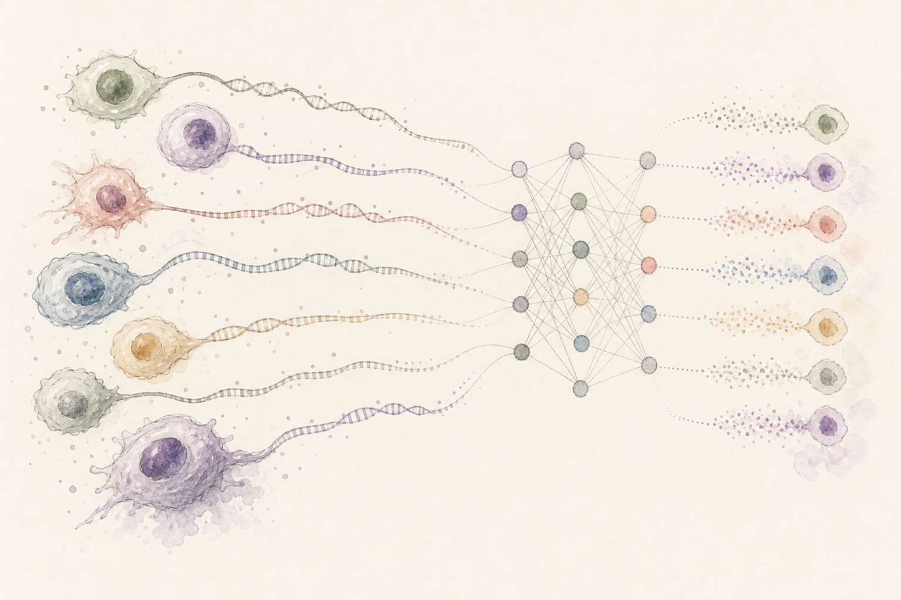
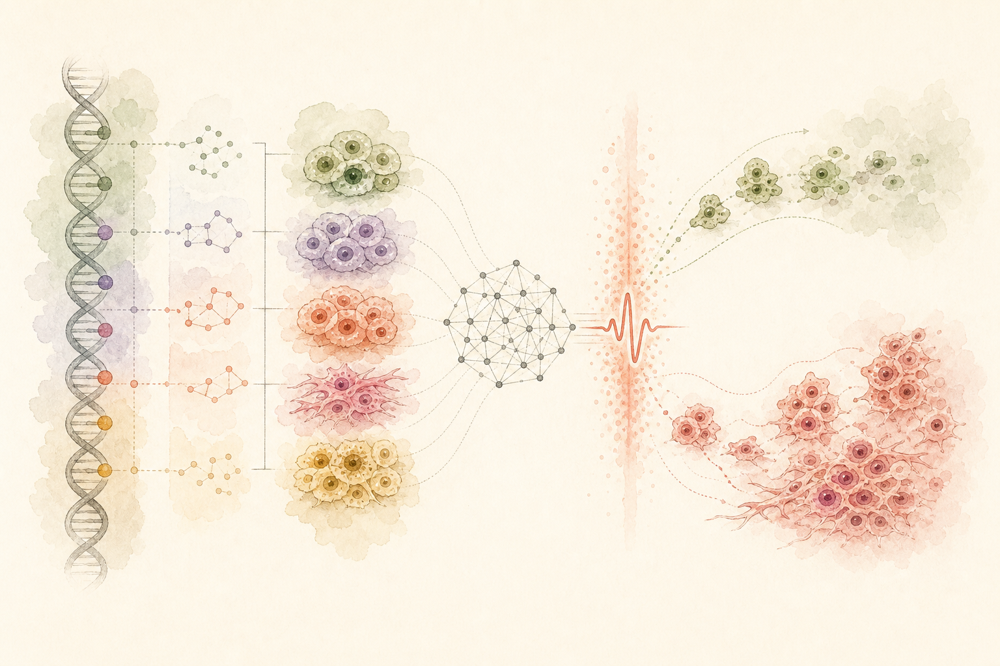

<!-- Generated by scripts/build_projects_page.py. Edit content/projects/*.md. -->
::: {.projects-page}
::: {.projects-heading}

Research · Projects

# Funded research

Our projects connect methodological development with biological questions, experimental design and clinical collaboration.
:::

01

AIRC BRIDGE · 2025–26
AI for clonal evolution under therapy

Characterising genotype and phenotype clonal evolution of response to therapy with Artificial Intelligence.

This project develops learning strategies to connect genomic alterations, cellular phenotypes and therapeutic response. The objective is to identify the evolutionary changes that allow resistant populations to emerge and persist.

<dl class="project-facts">
<dt>Funding</dt><dd>€100,000 · AIRC Foundation</dd>

<dt>Programme</dt><dd>BRIDGE Grant · Computational Biology</dd>

<dt>Leadership</dt><dd>Giulio Caravagna · Principal Investigator</dd>

<dt>Team</dt><dd>Cancer Data Science Laboratory</dd>
</dl>

Example papers changes on reload

02

PRIN · 2023–25
Machine learning for single-cell long-read sequencing

Algorithms that learn tumour structure from long molecular measurements collected one cell at a time.

The project combines single-cell resolution with long-read sequencing to observe linked molecular events that shorter assays cannot resolve. We develop models for noisy, heterogeneous measurements and use them to reconstruct cellular populations and their evolutionary relationships.

<dl class="project-facts">
<dt>Funding</dt><dd>€250,000 total · approximately €140,000 to the lab</dd>

<dt>Programme</dt><dd>PRIN · Italian Ministry of University and Research · PE6</dd>

<dt>Leadership</dt><dd>Giulio Caravagna · Principal Investigator</dd>

<dt>Co-PI</dt><dd>Alberto Cazzaniga · Area Science Park</dd>
</dl>

Example papers changes on reload

03

AIRC MFAG · 2021–25
Genotype, phenotype and therapeutic response

Characterising genotype and phenotype clonal evolution of response to therapy with Artificial Intelligence.

This programme established our integrated approach to cancer evolution: combine sequencing, quantitative models and biological validation to understand how treatment reshapes heterogeneous tumours and selects resistant clones.

<dl class="project-facts">
<dt>Funding</dt><dd>€500,000 · AIRC Foundation</dd>

<dt>Programme</dt><dd>My First AIRC Grant · Computational Biology</dd>

<dt>Leadership</dt><dd>Giulio Caravagna · Principal Investigator</dd>

<dt>Team</dt><dd>Cancer Data Science Laboratory</dd>
</dl>

Example papers changes on reload

:::
